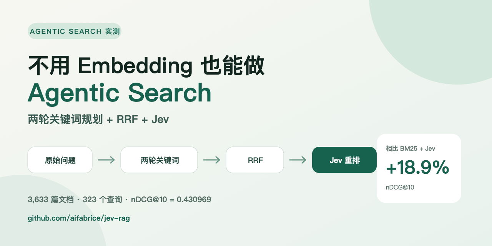

# 不用 Embedding 也能做 Agentic Search：两轮关键词规划 + RRF + Jev 实测



传统关键词检索最容易失败的一种情况，是用户的问题和文档说的是同一件事，却用了完全不同的词。

比如用户问“退款多久能到账”，文档里可能写的是“原路退回预计三个工作日完成”。如果查询里没有“原路退回”“工作日”这些词，BM25 很可能连候选文段都找不到。后面的重排模型再强，也无法救回一个根本没进入候选池的文档。

通常的解决办法是 Embedding。但我想测试另一条路径：**不建立向量索引，让大模型只负责生成更像文档语言的搜索词，再继续使用本地 BM25。**

## 一、Agentic Search 在这里到底做什么？

Jev RAG 的 Agentic 模式不是让 Agent 自由浏览文件，也不是让模型直接回答问题。模型只负责一件很小、边界很清楚的事：规划本地关键词搜索。

完整链路是：

```text
用户问题
  → 第一轮生成 5 条关键词查询
  → 原问题 + 5 条查询分别执行本地 BM25
  → RRF 融合第一轮结果
  → 读取最多 8 条标题与摘要
  → 第二轮生成 5 条补充查询
  → 再次执行本地 BM25，并与此前排名做 RRF
  → 保留 Top 50 候选
  → Jev 重排
  → Top 10 证据进入回答模型
```

这里有三个刻意的限制：

1. 查询规划器看不到官方相关性标签；
2. 第二轮只看少量标题和摘要，而且这些内容被当作不可信输入；
3. 最终搜索仍然发生在本地 SQLite FTS5 中，不生成文档 Embedding，也不建立向量数据库。

## 二、为什么要做两轮，而不是一次生成十个关键词？

第一轮负责扩大词汇面：缩写、同义词、可能出现的专业术语、具体实体。

第二轮则利用初步搜索结果做修正。第一轮返回的标题和摘要可能暴露文档真实使用的表达方式，也可能告诉规划器某个方向完全错了。

把两轮合成一次，会失去这种“搜索—观察—再搜索”的反馈。让模型自由执行很多轮，又会让延迟、费用和不可预测性快速增加。因此当前实现固定为两轮，每轮最多五条查询。

查询计划会按模型、原问题、轮次、已有查询和观察结果缓存在本地 SQLite 中。相同问题不需要反复支付规划费用。

## 三、多路 BM25 如何合并？

每条生成查询都会得到一份独立的 BM25 排名。不同查询的原始 BM25 分数不可直接比较，因此使用 Reciprocal Rank Fusion（RRF）按名次融合：

```text
RRF(document) = Σ 1 / (k + rank)
```

实验中 `k=60`。一个文档如果同时出现在原问题、同义词查询和第二轮补充查询的前排，会得到更高的融合分数。

每条查询最多召回 100 个本地候选，融合后只保留 50 个进入 Jev。这样查询扩展负责提高候选召回，Jev 负责判断哪些文段真正包含可以回答问题的证据。

## 四、完整 323 个问题的结果

测试使用 BEIR NFCorpus 的完整测试集：3,633 篇文档、323 个问题。

| 方案 | nDCG@10 | MRR@10 | Recall@10 | Recall@50 |
| --- | ---: | ---: | ---: | ---: |
| BM25 Top 50 | 0.305654 | 0.512697 | 0.147309 | 0.209810 |
| BM25 Top 50 + Jev | 0.362468 | 0.593023 | 0.164474 | 0.209810 |
| Agentic 关键词检索 Top 50 | 0.380168 | 0.597940 | 0.185464 | 0.280765 |
| **Agentic 关键词检索 + Jev** | **0.430969** | **0.644041** | **0.204138** | **0.280765** |
| 混合检索 + Jev | 0.444327 | 0.654583 | 0.214907 | 0.318075 |

相对 BM25 Top 50 + Jev，Agentic + Jev 的 nDCG@10 提升 18.90%。它和本次最好的 Embedding 混合检索 + Jev 相差 0.013358，也就是 3.01%。

这个差距不能直接说成“几乎一样”。对 323 个查询做 20,000 次配对 Bootstrap 后，Agentic 减去 Hybrid + Jev 的 95% 区间为 `[-0.025480, -0.001697]`，仍然偏向混合检索。

因此更准确的结论是：**Agentic 关键词检索是一条很强的无向量替代方案，但本次实验没有超过最佳的 Embedding 混合链路。**

## 五、提升到底来自哪里？

从 Recall@50 可以看出，Agentic 检索把候选池召回从 0.209810 提高到 0.280765。它解决的是“BM25 没用对词”的问题。

Jev 随后把 nDCG@10 从 0.380168 提高到 0.430969。它解决的是“候选已经找到了，但前排顺序不够好”的问题。

这两个阶段不能相互替代：

- 查询扩展负责让相关文档进入候选池；
- Jev 负责把候选池中有证据的文段推到前面；
- 回答模型只消费最终证据，不应该承担搜索和排序的全部责任。

## 六、成本和延迟

完整规划器运行记录了：

- 317,865 个输入 Token；
- 17,279 个输出 Token；
- 观测费用 0.105439 美元。

Jev 阶段记录了 8,817,321 个输入 Token、369,835 个输出 Token，观测费用 0.370327 美元。两部分合计 0.475766 美元。

估算的串行在线延迟中位数为 7,516 ms，p95 为 26,347 ms。缓存、网络和服务商状态都会明显影响这些数字，所以它们是一次运行的观测值，不是长期 SLA。

与 Embedding 相比，Agentic 模式不需要一次性为整个语料建向量索引，但每个新问题需要规划器调用。它更适合语料经常变化、问题量不大、又不想维护向量基础设施的场景；高查询量场景则必须认真计算单位查询成本。

## 七、无向量不等于完全离线

这是最容易被标题掩盖的一点。

Agentic 模式没有 Embedding 和向量索引，但查询和少量第一轮摘要会发送给规划模型；候选文段会发送给 Jev；最终证据会发送给回答模型。

如果资料不能离开本地，仅仅“没有向量数据库”并不能解决隐私问题。你仍然需要本地部署规划器、重排器和回答模型，或者停留在纯本地 BM25 搜索。

## 八、什么时候值得使用？

Agentic 关键词检索比较适合：

- 文档含有明确的产品名、缩写、法规条款和业务术语；
- 用户问题和文档表述经常不一致；
- 语料更新频繁，不想反复重建 Embedding；
- 希望搜索过程可观察、可缓存、可人工检查；
- 可以接受每个新问题增加一次或两次规划调用。

如果查询量很大、同义改写复杂，而且已经有成熟的向量检索基础设施，混合检索通常仍然更稳妥。

## 九、如何复现

```bash
python scripts/benchmark_beir.py \
  --dataset nfcorpus \
  --top-k 50 \
  --agentic \
  --agentic-model minimax/minimax-m3 \
  --agentic-rounds 2 \
  --agentic-queries 5 \
  --agentic-per-query-k 100 \
  --agentic-domain-hint medical \
  --rrf-k 60 \
  --use-jev \
  --provider openrouter \
  --output .knowledge/public-benchmarks/results/nfcorpus-agentic-jev.json
```

先加 `--limit-queries 10` 可以低成本检查接口和缓存是否正常。10 个问题只能验证链路，不能和完整 323 查询结果比较。

项目地址：<https://github.com/aifabrice/jev-rag>

在线 Benchmark：<https://aifabrice.github.io/jev-rag/>

完整配置、费用与局限：<https://github.com/aifabrice/jev-rag/blob/main/benchmarks/NFCORPUS_RESULTS.md>

这些结果是项目自行运行的公开评测，不是官方 MTEB 提交。代码、汇总结果和复现命令都已开源，欢迎用其他中文或英文数据集复现。

