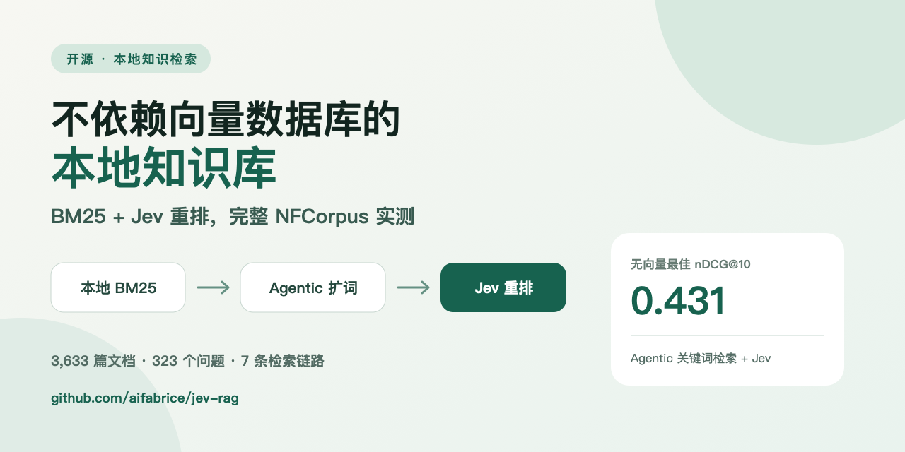

# 我做了一个不依赖向量数据库的本地知识库：BM25 + Jev 重排实测



做本地知识库时，很多方案的第一步都是：切分文档、生成 Embedding、部署向量数据库，再做召回和重排。

但我一直有一个问题：**如果资料本身有明确的词汇、标题和业务术语，能不能先用最朴素的关键词检索完成候选召回，再让模型判断哪些证据真正相关？**

于是我做了 [Jev RAG](https://github.com/aifabrice/jev-rag)：默认使用 SQLite FTS5/BM25 在本地检索，再用 Jev 对候选证据重排，最后把筛选后的证据交给大模型生成带引用的答案。它不要求向量数据库，也不需要 GPU。

这篇文章不是要证明“关键词一定胜过向量”，而是记录这条路径究竟能走多远，以及什么时候值得加上 Embedding。

## 一、最小可用链路

默认链路只有四步：

```text
本地文件夹
  → 标题感知的文段切分
  → SQLite FTS5 / BM25 召回 Top 30
  → Jev 判断每个文段是否包含可回答问题的具体证据
  → MiniMax 根据 Top 10 证据流式回答，并附文件与行号引用
```

这里的 Jev 不是回答模型，而是第二阶段的相关性判断器。系统会针对每一个候选文段提出结构化的相关性问题，把 Jev 分数用于重新排序。

BM25、索引和历史记录都保存在本地 SQLite 中。只有候选文段需要发送给所配置的 Jev 服务；生成回答时，最终证据会发送给回答模型。

## 二、不用向量数据库，还需要分块吗？

需要，但原因不是 Embedding。

如果直接把一整份几十页的文档当成一个检索单元，会出现三个问题：

1. BM25 命中的是整份文件，无法定位真正相关的段落；
2. Jev 需要阅读大量无关内容，成本和延迟都会上升；
3. 回答模型拿到的上下文过长，引用也不够精确。

所以 Jev RAG 默认使用“标题 + 段落”的证据粒度。很短的文档可以选择不切分，但大多数真实资料仍然应该按自然结构切开。**分块是检索和引用的粒度设计，不是向量数据库的专属步骤。**

## 三、BM25 到底够不够？

为了避免只用几个手写问题自测，我把完整的 BEIR NFCorpus 测试集跑了一遍：

- 3,633 篇文档；
- 323 个测试问题；
- 所有方案使用同一测试集；
- 官方相关性标签不进入查询规划或重排提示；
- 结果是项目自行运行的公开评测，不是官方 MTEB 提交。

完整结果如下：

| 检索链路 | nDCG@10 | MRR@10 | Recall@10 |
| --- | ---: | ---: | ---: |
| BM25 Top 30 | 0.305654 | 0.512697 | 0.147309 |
| BM25 Top 30 + Jev | 0.353235 | 0.585817 | 0.158667 |
| BM25 Top 50 + Jev | 0.362468 | 0.593023 | 0.164474 |
| Agentic 关键词检索 Top 50 | 0.380168 | 0.597940 | 0.185464 |
| BM25 + Embedding RRF | 0.396712 | 0.632089 | 0.193977 |
| Agentic 关键词检索 + Jev | 0.430969 | 0.644041 | 0.204138 |
| 混合检索 Top 50 + Jev | **0.444327** | **0.654583** | **0.214907** |

在线交互版 Benchmark：<https://aifabrice.github.io/jev-rag/>

### 观察一：Jev 的价值很直接

BM25 Top 30 加上 Jev 后，nDCG@10 从 0.305654 提升到 0.353235，相对提升 15.57%。

Recall@30 没有变化也很正常：重排只能重新排列已经召回的候选，无法找回 BM25 根本没有召回的文档。这也是整个实验里最重要的边界——**重排不能替代召回。**

### 观察二：多召回一些，不一定更划算

把候选池从 30 扩到 50，nDCG@10 继续提升到 0.362468，但中位重排延迟从 1,075 ms 增加到 1,921 ms，观测到的服务成本也提高了约 59.56%。

因此项目默认仍然选择 Top 30。Top 50 不是“更高级的默认值”，而是质量优先时可以打开的选项。

### 观察三：不用 Embedding，也可以做 Agentic 检索

纯 BM25 最大的问题是用户问题和文档用词可能不一致。我的无向量解决办法是让 MiniMax 生成多组可能出现在文档里的关键词：

1. 第一轮根据原问题生成 5 条检索词；
2. 分别执行本地 BM25；
3. 查看最多 8 条初步结果的标题和摘要；
4. 第二轮再生成 5 条补充检索词；
5. 用 RRF 融合所有 BM25 排名，保留 Top 50；
6. 最后交给 Jev 重排。

这条 Agentic 关键词检索 + Jev 的 nDCG@10 达到 0.430969，相比 BM25 Top 50 + Jev 提升 18.90%，距离本次最好的“混合检索 + Jev”只差 3.01%。

但“无向量”不等于“完全离线”或“没有模型成本”。Agentic 模式仍然要调用查询规划模型，Jev 重排也需要远程服务。它省掉的是 Embedding 索引和向量基础设施，而不是所有外部调用。

### 观察四：Embedding 仍然有价值

本次最佳结果来自 BM25 与 `text-embedding-3-large` 的 RRF 融合，再经过 Jev 重排，nDCG@10 为 0.444327。

这说明更合理的结论不是“不要向量”，而是：

> 先建立一个便宜、透明、可解释的关键词基线，再用真实评测决定是否增加 Embedding。

对于术语稳定、文件规模不大、中文关键词明确的内部资料，BM25 + Jev 可能已经足够。对于同义改写多、概念表达分散的语料，混合检索通常更有优势。

## 四、开发过程中踩过的几个坑

### 1. 中文不能只按空格分词

FTS5 默认策略对连续中文不够友好。项目会保留较短中文词，并为连续中文生成重叠二元组，让两三个字的常见业务词也能被召回。

### 2. 一次把 30 个候选全部发给重排模型容易超上下文

现在候选按每组 10 条分批，并发执行，最后再合并绝对分数。这样更稳定，但也要承认：不同批次之间的分数未必完全可比。

### 3. 只记录“总耗时”看不出问题

界面现在分别记录 BM25、Agentic 查询规划、Embedding/RRF、Jev、首 Token、回答生成和总耗时。这样才能判断慢在召回、重排，还是回答模型。

### 4. 缓存会让 Benchmark 看起来过于乐观

查询规划、Embedding 和 Jev 结果都可以缓存。恢复中断的评测很方便，但汇总延迟时必须区分冷调用与缓存命中，不能把缓存主导的时间当成真实线上延迟。

## 五、如何本地跑起来

```bash
git clone https://github.com/aifabrice/jev-rag.git
cd jev-rag
python -m pip install -e '.[documents]'
cp .env.example .env
jev-rag serve
```

浏览器打开：<http://127.0.0.1:8765>

不配置 API Key 也可以完成本地索引和 BM25 检索；Jev 重排、Agentic 查询规划、Embedding 和大模型回答需要配置对应服务。

如果只想先检查 Benchmark 脚本，不产生付费调用：

```bash
python scripts/benchmark.py
```

完整 NFCorpus 配置、成本、延迟和复现命令在：

<https://github.com/aifabrice/jev-rag/blob/main/benchmarks/NFCORPUS_RESULTS.md>

## 最后的结论

这次实验给我的结论很简单：

- BM25 仍然是一个非常值得保留的基线；
- Jev 重排可以明显改善候选证据的前排质量；
- Agentic 多关键词检索能在不建立向量索引的情况下补充语义召回；
- Embedding 在这组数据上仍然取得了最好的整体结果；
- 是否需要向量数据库，应该由语料、隐私边界、延迟预算和实测收益共同决定。

项目已用 MIT 协议开源：<https://github.com/aifabrice/jev-rag>

如果你有适合测试的中文公开数据集，或者正在做类似的本地知识检索，欢迎提交 Issue、Discussion 或 PR。下一步我也想继续补充中文检索数据集、更多重排基线，以及不同文档切分策略的对比。
