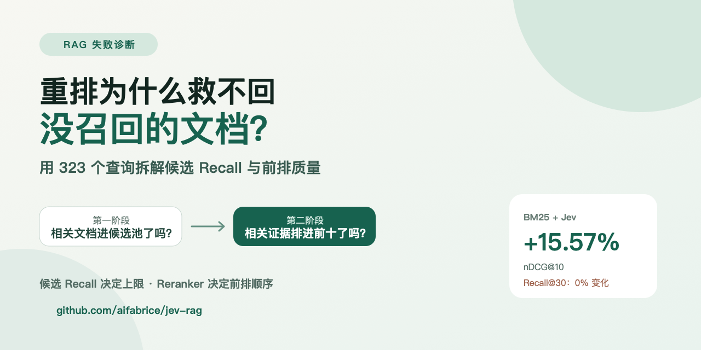

# 重排为什么救不回没召回的文档：用 323 个查询拆解 RAG 的召回与重排

做 RAG 时，一个常见升级路线是：第一阶段先召回一批候选，再接一个更强的 Reranker。

但系统效果不好时，到底应该换 Embedding、扩大候选池，还是升级重排模型？如果没有把“候选召回”和“前排排序”分开测，很容易花钱优化错地方。

我在 Jev RAG 上跑完 3,633 篇文档、323 个查询的 BEIR NFCorpus 测试后，最清晰的结论是：

> 重排可以把已经找到的证据移到前面，但无法找回从未进入候选池的文档。

## 一、先区分两个完全不同的问题

第一阶段检索回答的是：相关文档有没有进入候选池？

第二阶段重排回答的是：进入候选池以后，相关文档能不能排进最终前几名？

因此至少要同时看两组指标：

- `Recall@candidate_pool`：候选池里覆盖了多少相关文档；
- `nDCG@10`、`MRR@10`、`Recall@10`：前十名排得好不好。

如果候选 Recall 很低，Reranker 没有材料可排；如果候选 Recall 已经很高但 nDCG 很低，问题才更可能出在排序阶段。

## 二、BM25 加 Jev 后发生了什么？

默认实验先用 BM25 召回 30 个候选，再让 Jev 判断每个文段是否包含可以回答问题的具体证据。

| 指标 | BM25 | BM25 + Jev | 相对变化 |
| --- | ---: | ---: | ---: |
| nDCG@10 | 0.305654 | 0.353235 | +15.57% |
| MRR@10 | 0.512697 | 0.585817 | +14.26% |
| Recall@10 | 0.147309 | 0.158667 | +7.71% |
| Recall@30 | 0.189025 | 0.189025 | 0% |

前排指标明显改善，但 Recall@30 完全不变。

这不是 Jev 没有效果，而是重排的数学边界：Top 30 的成员没有变化，只是顺序变化。Jev 在 323 个问题中让 129 个问题的 nDCG@10 提升、143 个持平、51 个下降，但它无法把 Top 30 之外的相关文档变出来。

## 三、把候选从 30 扩到 50 是否有用？

候选池扩大后，候选 Recall 从 0.189025 提高到 0.209810，相对提升 11%。这给了 Jev 更多可以重新排序的材料。

Top 50 + Jev 的 nDCG@10 从 0.353235 提高到 0.362468。Jev 把 477 个原本位于 BM25 第 31–50 名的候选推入最终 Top 10，其中 77 个是相关文档，覆盖 47 个查询。

这证明扩大候选池确实产生了真实收益，但平均提升并不大，而且代价明显：

| 候选池 | Jev 中位延迟 | p95 延迟 | 观测费用 |
| --- | ---: | ---: | ---: |
| Top 30 | 1,075 ms | 16,953 ms | $0.163658 |
| Top 50 | 1,921 ms | 17,840 ms | $0.261124 |

候选从 30 增到 50，中位延迟增加 78.70%，费用增加 59.56%。质量提高了，但不是免费午餐。

## 四、真正提高候选 Recall 的两种方法

### 方法一：Agentic 多关键词检索

MiniMax 根据原问题生成两轮关键词查询，每轮五条；每条查询在本地执行 BM25，再用 RRF 融合排名。

候选 Recall@50 从 BM25 的 0.209810 提高到 0.280765。经过 Jev 后，nDCG@10 达到 0.430969。

这条路径不建立 Embedding 或向量索引，但需要在线查询规划调用。

### 方法二：BM25 + Embedding 混合召回

BM25 Top 50 与 Embedding Top 50 用 RRF 融合，候选 Recall@50 达到 0.318075。再经过 Jev 后，nDCG@10 达到本次最高的 0.444327。

Embedding 混合召回的候选覆盖最好，但需要一次性建立向量缓存，并增加远程数据边界。

## 五、一个更实用的诊断顺序

当知识库回答不准时，我现在会按以下顺序排查：

1. **确认标注问题**：先准备一组真实问题和已知相关文档；
2. **测候选 Recall**：检查相关文档是否进入 Top 20、30 或 50；
3. **看失败查询的词汇差异**：是同义词、缩写、中文切词，还是过滤条件？
4. **再测 Reranker**：只在候选池包含答案时分析排序质量；
5. **最后测回答模型**：确认最终证据正确但回答仍然失败，才应该改 Prompt 或模型。

不要一开始就把所有问题归因于 LLM。很多“回答模型幻觉”，实际是上游根本没有提供正确证据。

## 六、什么时候扩大候选池，什么时候换召回方式？

扩大候选池适合相关文档通常排在当前截断线附近的情况，例如经常出现在第 31–50 名。

如果相关文档在 BM25 Top 100 里都不存在，单纯从 Top 30 改成 Top 50 没有意义。这时应该解决查询与文档用词不一致的问题：

- 增加中文切词、同义词或领域词典；
- 使用 Agentic 查询扩展；
- 加入 Embedding、稀疏向量或混合检索；
- 修正元数据过滤和文档切分方式。

而当候选 Recall 已经足够高、相关文档却长期排在后面时，更强的 Reranker 才是优先项。

## 七、对系统设计的启发

一条可调试的检索链路应该分别记录：

- 原始查询和实际使用的搜索词；
- 每一路召回结果和排名；
- 候选池截断位置；
- Reranker 前后的名次变化；
- 最终交给回答模型的证据；
- 各阶段延迟、Token 和费用。

Jev RAG 的界面和运行记录会分别显示 BM25、Agentic 规划、Embedding/RRF、Jev、首 Token、回答生成和总耗时。目标不是让界面更复杂，而是让每次失败都有可以定位的阶段。

## 结论

RAG 检索不是一个模型，而是一条流水线。

- 候选 Recall 决定了系统的理论上限；
- Reranker 决定相关证据能否进入前排；
- 回答模型决定如何使用已经选出的证据；
- 扩大候选池可以提高上限，也会增加延迟和成本；
- 当候选 Recall 已经不足时，继续升级 Reranker 不会解决根因。

项目地址：<https://github.com/aifabrice/jev-rag>

互动 Benchmark：<https://aifabrice.github.io/jev-rag/>

完整结果与复现命令：<https://github.com/aifabrice/jev-rag/blob/main/benchmarks/NFCORPUS_RESULTS.md>

所有数字来自项目在公开 BEIR NFCorpus 测试集上的自行运行结果，不是官方 MTEB 提交。

